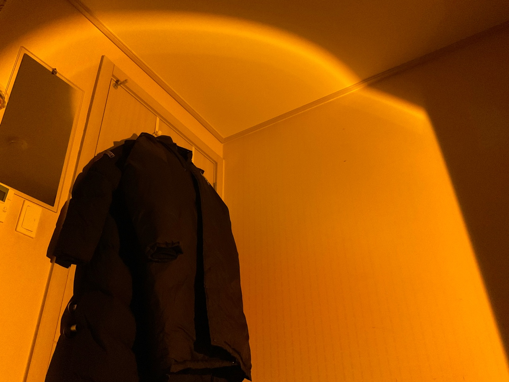

어느덧 시간이 흘러 12월이다. 세상에 나 이제 4학년 되는거야? ~~기말도 보지 않았는데 참 유난이다.~~  
일적으로, 개인적으로 많은 것을 경험해보고 싶은데 어느덧 대학교에서 다닐 시간이 딱 1년이 남았다는게 믿기지가 않는다.

여담: 전등을 샀다. 일주일에 5일은 방에서 안나가고 공부를 하던 때가 있었는데 전등 하나로 공간이 달라보인다. 다들 전등 하나씩 장만하시길:D (요즘 블프라 세일도 많이 하니깐...)

동아리 회장도 다 끝나가고, 랩실에 소속되었던 과제도 끝나간다. 이제는 조금 나를 돌아보고 싶다는 욕심이 생긴다. 한마디로, 내 일에 집중을 하겠다는 이야기.

### 아직 부족한 것들이 너무 많다

1년동안 너무 많은 책임들에 억눌려 있었다. 내가 주도하는 프로젝트들이 참 많았고, 참 잘 견뎌냈다고 생각한다. 

물론 이것들이 나를 성장하게 만들어준 귀중한 시간이었지만, 아직은 무언가를 주도해서 내 가치를 실현시키기에는 부족하다는 판단이 많이 든다.

이제는 **이끌어가는 것이 아닌 어디에 소속되어서 배우고픈 욕심**이 자꾸만 생긴다. 무언가를 주도하면서 느꼈던 부족함들을 채워나갈 수 있는 곳에 소속되고 싶다. 내가 다시 이끌어나갈 수 있게.

말은 거창하게 했지만 사실 요즘 대학원, 논문, 회사, 스타트업, 전문연구요원, 장교(!) 등 내가 선택할 수 있는 진로를 여러가지 고민중이다. 내가 소속되어서 나의 가치를 실현할 수 있는 곳은 어디일까.

### 사실 마음의 결정은 어느정도

내린 상태이다. 방학동안 내가 다니던 랩실의 지도교수님이 과제 참여대신 개인 연구를 허락해주시면서 주제를 하나 주신 상태이다. 2월까지 한번 이 주제를 가지고 깊게 파보고 싶다. 잘 되면 논문도 써볼 수 있을지도?

또 지금 창업 목표 프로젝트도 하고 있어서, 개발자로서도 성숙해지고 싶은 마음이 있다. 개발자로서의 성장은 이제 배우고 싶은거 있으면 그냥 시간 투자하면 못 배울건 없다는 마인드라... ㅎㅎ
* 요즘은 포트폴리오 만드느라 글을 자주 못쓰고 있다. 겨울방학 동안 핵심 부분 위주로 개발할 예정!

### 그래도 참 하고 싶은게 너무 많다.

요즘 일얘기만 블로그에 써놓는거 같아서 개인적인 이야기도 조금 해볼까?

고수가 많고 개발 문화가 성숙한 곳에서 개발자로 일도 해보고 싶다(아이 또 일얘기네). 스타트업에서 능력있는 사람들과 밤새 일해보고 싶다(이제 진짜 일얘기는 그만!).

한달동안 어디 가서 노트북 없이 살아보고 싶다. 음 부산? 제주도? 바다가 있는 곳이면 좋겠다. 가서 넷플릭스도 몰아서 보고, 새로운 취미도 찾고 요리도 하고 (인스타그램 @hojin_bakery 팔로우 ㄱㄱ) 음음... 암튼 일 밖의 것들을 채워넣고 싶은 욕심이 있다.

개인적인 부분을 조금씩 놓치고 살아오기도 했고 한번 슬럼프가 오기도 했으니 나를 조금 다독여주고 싶다.

그런 의미에서 동아리 회장 생존기 시리즈가 끝나면 블로그 시리즈를 하나 추가해볼까 생각중이다. 주로 취미나 일상생활에 대한 내용을 기록할 것 같다. 사실 요즘은 블로그 쓰는게 취미인 듯 하기도 하고...

> 많아서 흘러 넘치려는 생각들을 여기에 조금 덜어보려 한다. 잘 할수 있겠지? 일단 하고 보자. - 글쓰는 사람으로 성장하기 EP 1.

일상생활속에서 느껴지는 감정들을 여기에 담으려 했던것이 원래 의도기도 했고 ~~지금은 개발자 일기로 변한지 오래지만~~ 다시 초심(?)을 찾아보자.

-끝!-
