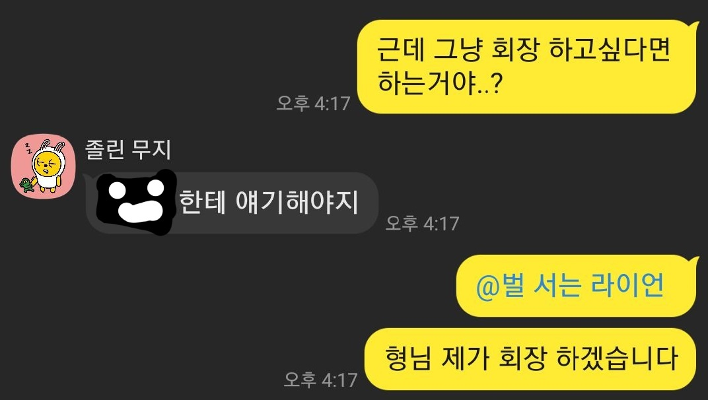
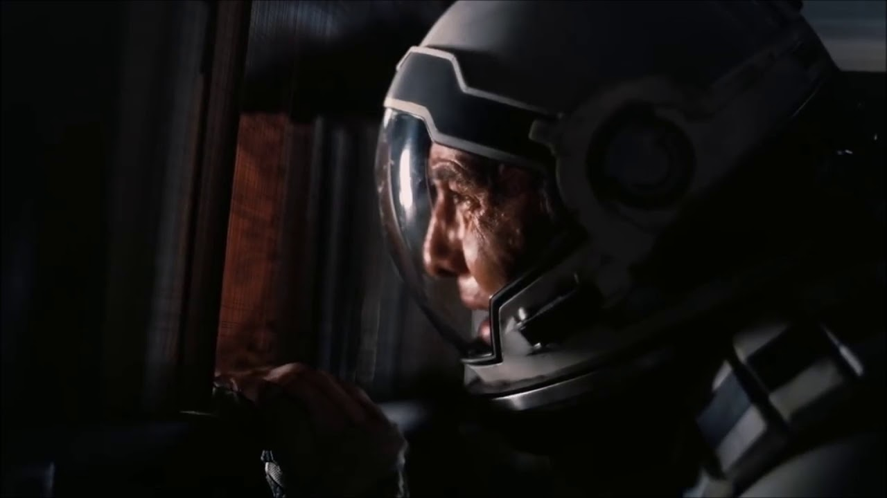
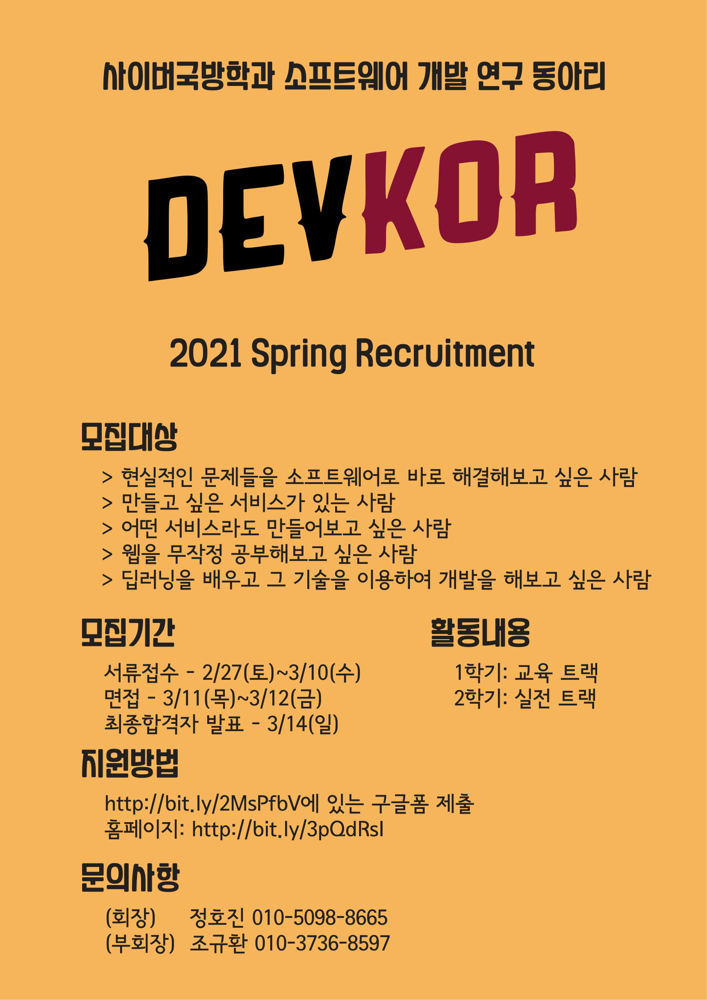
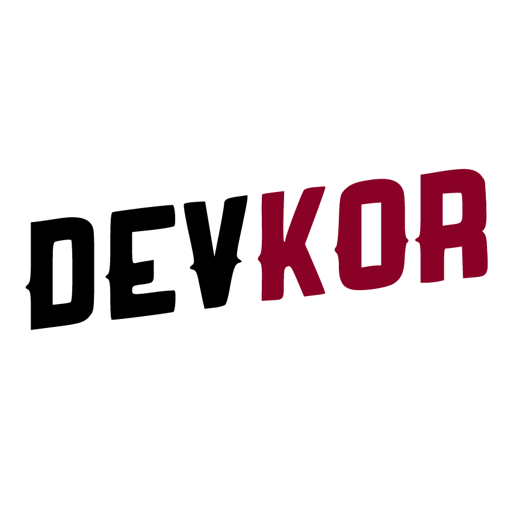
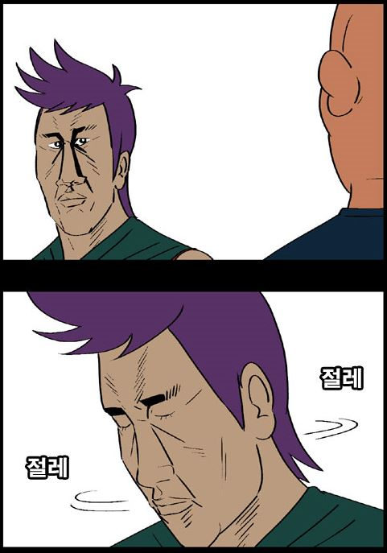

> 동아리 회장은 하는거 아니라고 했는데..

여튼 저튼 회고록 겸 느꼈던 감정들을 여기에 풀고자~~하소연하고자~~ 이 글을 남긴다.

## 그러게요 제가 왜 회장을 했을까요..
대학교에 입학하고 나서 정말 의미있다고 생각한 경험들 중 하나는 개발을 시작한 것이다. 보안을 전공하는 과 특성상 개발은 비주류로 인식되기 마련인데, 재미 하나로 뛰어든 곳에서 내 적성과 미래를 찾을줄은 정말 꿈에도 몰랐다. 1학년 여름방학때 밤새가며 웹개발을 배웠고, 이걸로 외주를 뛰었고, 2학년 2학기에는 인공지능을 배웠다. ([정연길 선배](https://github.com/distrue), [이태호 선배](https://github.com/adldotori) 다시 한번 감사합니다) 이 두 기술 덕분에 내가 선택할 수 있는 꿈의 폭이 늘어났고 잊어버렸던 꿈도 다시 도달할 수 있다는 희망을 가지게 되었다. (자세한 이야기는 기회가 되면 더 풀어보도록 하겠다.)

### 1. 가르친다는 활동은 참 가치있다고 생각한다
여튼 저튼 동아리에서 선배들에게 향후 내 진로를 결정지을만한 기술들을 배울 수 있다는 경험이 정말 충격적이었다. 고등학교에서 뭔가를 가르쳐준다는 것은 거의 있을 수 없는 일이다 보니 더욱. 먹고살기도 바빴을텐데... 왜 가르쳐준 것일까? 선배들한테도 직접 물어보고 내 스스로도 생각해보고 결론을 내린 것은... **이런 활동이 내가 담고 있는 일의 파이를 키우고, 다시 그것이 나한테도 이득이 된다는 것**이다. 
그래서 누군가를 가르치는 일은 비즈니스적으로도 개인적으로도 가치있는 활동이라고 생각했다.

### 2. 개인적으로 애정이 많았던 동아리가 죽어가는것도 보기 마음아팠다
내가 배우던 무렵 동아리는 해가 거듭하면 할수록 점점 톡방에 거미줄이 쳐진다고 생각할 정도로 활동이 너무 없었다. 물론 세미나가 있었지만 아무리 많이 들어도 3~4명 이었고 유령 회원도 정말 많다고 판단했다. 당장 이번년도 회장을 맡을 사람도 많이 안보였고, 말 그대로 "정말 이 동아리가 영영 사라진다"는 생각이 들었다.

### 3. 약간의 대의..?
사실 과가 생긴지 얼마 되지 않다보니 참고할만한 레퍼런스가 없어 보안 외의 진로를 찾기도 너무 힘든 환경이고, 무언가를 배우고 싶어도 과 밖에서 굴러가며 배워야 했다. 선배들이 그런 것 처럼 후배들에게 미약하지만 도움이 되고 싶었고, 나를 키워준 동아리에게도 정말 고마웠기 때문에 보답하고 싶었다. 아마 이 동아리를 이끌던 전 회장단들도 비슷한 마음이려나..?

## 어쩌다 보니 끝장을 봤다
마침 신입생들에게 내가 대신 동아리를 소개할 기회가 있었고, 그 무엇도 정해지지 않은 상태에서 9일 전에 회장을 결심하고 동아리 방향을 아예 틀었다. 어떤 것들을 해야하는지 전혀 몰랐지만, 대신 하고싶은건 있었다.

기존의 동아리에서 고치고 싶은 문제는 크게 두가지였다.
1. 사람이 너무 없다. 
    * 학과 내에서 개발은 비주류에 속한다. 사람이 너무 적어서 언제 대가 끊겨도 이상하지 않다.
2. 개발자밖에 없다.
    * 가장 큰 문제라고 생각했다. 
    * 개발자밖에 없다보니 협업도 어디서 줏어들은걸 잘못 써먹는 수준이고, 디자인도 구리고, 기획도 쓰레기다.

그래서, 몇가지 해결 방안들을 생각해봤다.
1. 과 안에서만 부원을 모으던걸 학교 전체로 확장
    * 기술은 가르치면 된다고 생각했다.
    * 이 학교 올 정도면 다들 똑똑한 사람들이니 쉽게 이해할 것 같았다.
2. 교육을 최소화하고, 팀 프로젝트로 문제를 해결하는 경험을 하자
    * 역설적이지만, 현실에서 실제 서비스를 만드는 것이 최고의 교육이라고 생각했다.
    * 최소한의 무기만 쥐어주고, 바로 써먹는 것을 경험시켜주고 싶었다.

평소에 같이 공부하던 동기들을 중심으로 6명으로 된 운영진을 꾸렸고, 매주 회의를 해가며 처음부터 끝까지 동아리의 모든것을 채워나가기 시작했다.

## 솔직히 말하면 겁나서 덜덜 떨었다

나는 누군가를 이끌 능력도, 카리스마도, 자신감도 없다고 생각했다. 지금 돌아봐도 냉정하게 비전 말고는 아무것도 없었다. [선천적으로 겁이 많았고](/posts/글쓰는%20사람으로%20성장하기/1/), 우유부단했다. "내가 저 사람보다 능력이 없는데, 나한테 올까?"라는 질문을 정말 끊임없이 던져댔다. 정말 심하면 깨어나있는 시간의 반을 부정적인 생각을 하느라 보냈던 것 같다. 원래 있던 불면증도 심해졌었고, 포기할까 매일 생각했다.

### 매일 매일이 처음

다 처음하는 것이었다. 물어볼 사람도 별로 없었고 매일 매일이 실수의 연속이었다. 동아리 로고를 만드느라 별 짓을 다했고, 동아리 포스터를 만드느라 일러스트레이터 강의를 찾아봤고, 리크루팅 과정에서 문자를 보내느라 단체메시지 발송의 어려움을 체험했고(api를 후킹해서 사람마다 면접 시간을 다르게 해서 보냈다... 자세한건 나중에 기술 블로그에서 풀어보겠다), 면접 시간을 조정하느라 엑셀을 배웠고, 등등... 참 어려웠다.

초보 회장은 리크루팅 과정에서부터 실수를 했다. 면접 시간이 담긴 문자를 보냈는데, 날짜와 요일을 다르게 해서 하루씩 밀려 보냈다.. 30분만에 스무명 가까이 문의 문자를 받고 사색이 된 회장님의 표정은 정말 가관이었다. 그떄 마침 밥먹고 있었는데 체한체로 정정 문자를 보냈다. 다시는 하기 싫은 실수 중 하나이다.

### 이 동아리를 정말 좋아했기 때문에 그만큼 힘들었다

> Love + Mistake = Hate

가장 힘들었던 경험은 온라인에서 운영진끼리 회의를 할때 말을 꺼내면 아무도 대답이 없을 때였다. "내가 너무 독닥적인가?" "너무 우유부단한가?" "나를 무능한 회장이라 생각하고 있으려나.."
무엇보다 힘들었던 것은 이 일을 망쳐서 내가 좋아하는 사람들과 다시는 즐거운 일들을 하지 못할 것 같다는 두려움이었다. 다들 각자의 분야에서 빛나고 있는 사람들이었기에 이들의 시간을 뺐는다는 죄책감도 있었던 것 같다. 시간이 지나고 나서 좋은 사람이 좋은 회장과 일치하지 않는다는 것이지만, 그때는 이걸 받아들이기가 힘들었다.

### 그땐 그랬다

여하튼 좀 절망적으로 쓰긴 했는데(철이 없었죠.. 생각이 너무 많았음), 아직 시작도 안했다. 동아리는 막 리크루팅을 시작하던 때였다.

직접 동아리를 운영하며 경험하고 깨달은 내용들은 다음에 다루도록 하고, 오늘은 여기서 마무리해야겠다.