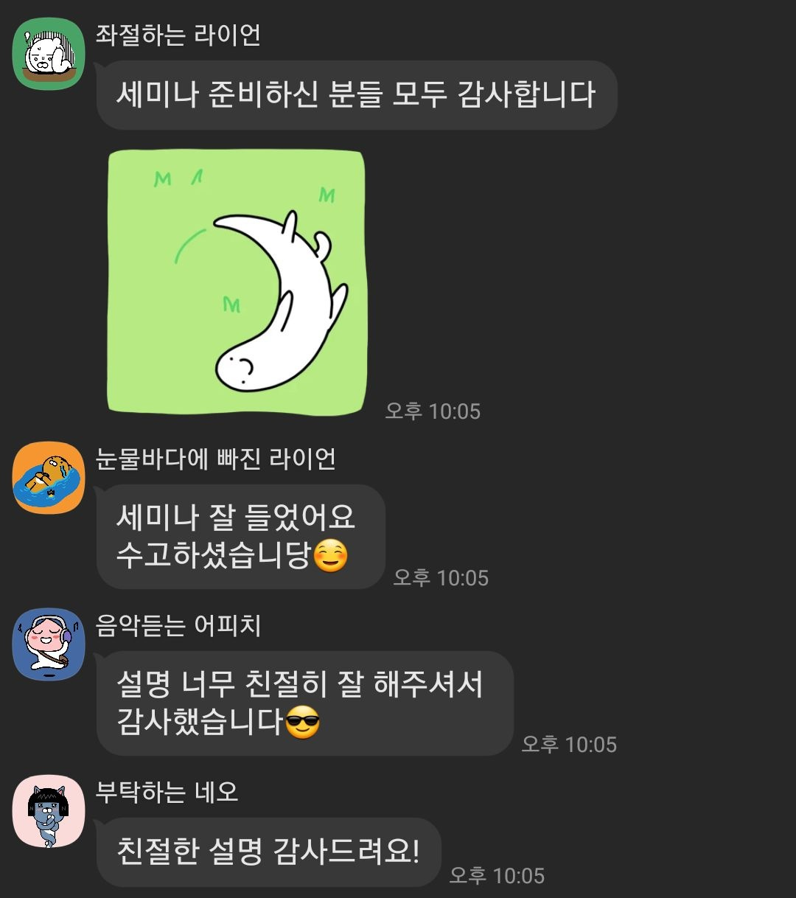
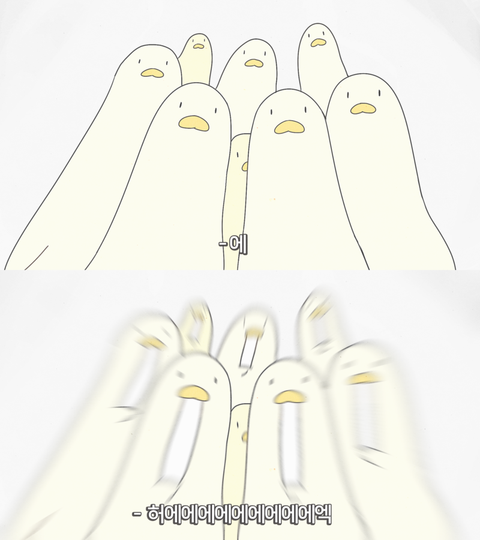
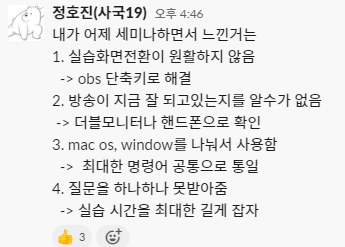
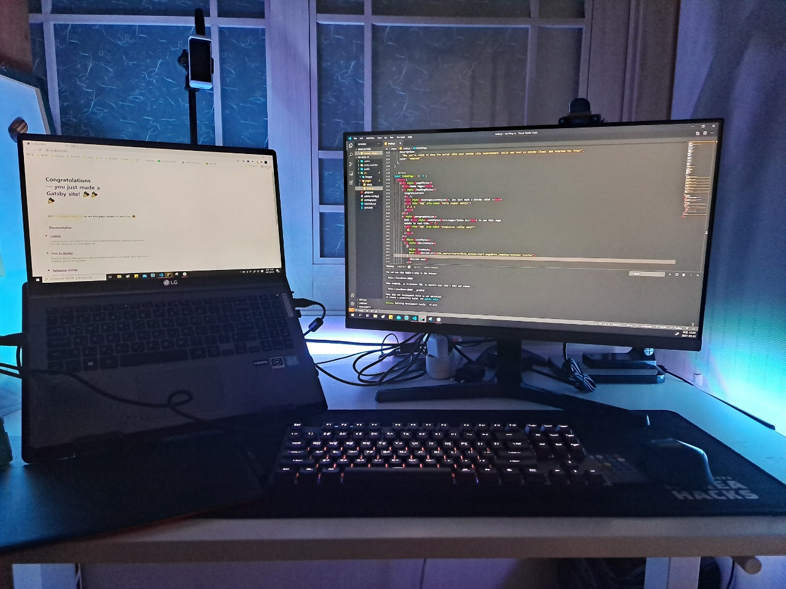

동아리의 1학기 목표는 "개발에 필요한 여러가지 지식들을 전달해주자"였다. 그러한 목표 아래 여러가지 일들을 벌였는데, 그 중 하나가 세미나라고 할 수 있겠다.

OT와 함께 기초 세미나를 기획했고, 첫 활동인 만큼 정말 열심히 준비했다. 터미널을 여는법, 명령어를 치는법, git/github 등등.. 내가 배워왔던 과정의 기억을 더듬어 가면서 자료를 만들었다.

그렇게 열심히 동아리를 준비했는데 첫 활동인 세미나는 어땠을까? 과연? ㄷㄱㄷㄱ

## 첫 세미나
망했다. ㅎㅎ  
그냥 망했어요

> 누구나 그럴싸한 계획은 가지고 있다. 쳐맞기 전까지는 - 마이크 타이슨

지금 와서 왜 망했을까를 생각해보면 망할 수 밖에 없더라
* 첫 강의였다. 진행이 서툴렀다. (zoom, obs 사용법 등등..)
* 나도 처음 시작할때는 정말 어려웠었는데, 이걸 넘을만큼 내 강의력이 좋지 않았다.
    * 나도 vscode에서 root repository가 뭔지를 이해하고 터미널을 띄울때까지 4시간이 걸렸는데.. 그걸 까먹니
* 몰려드는 질문을 처리할만큼 내 역량이 충분하지 않았다.
    * *mac인데 실행이 안돼요 ㅠㅠ, 혹시 이거 다시 설명해주실 수 있나요?*
    * 예측했던 질문 수보다 정말 많은 질문을 해주셨다.
    * 질문을 하나하나 받다보니 시간이 너무 길어졌다.
    * 시간이 길어지다보니 멘탈이 나갔다.

개인적으로는 엄청 준비를 많이 했다고 생각했는데, 생각대로 풀리지 않아 당황하는 나를 보고는 실망하기도 했다.

그래도 동아리 부원분들이 잘 들었다고 피드백을 주셔서 나름은 뿌듯함을 안고 잠에 들 수 있었다.

## 혼돈의 세미나 준비
첫 세미나를 마치고, 마음속은 비상사태였다. 앞으로 매주 세미나를 진행해야 할텐데... 더 이상 미룰 수는 없는 노릇 아닌가. 더 많은 생각이 필요함을 느꼈다.

바로 운영진이 모여있는 slack에서 오늘 느낀 점들을 공유했다.

더블모니터도 곧바로 샀다. 인생 첫 더블 모니터를 이렇게 급하게 사고싶지는 않았지만... 그래도 나름 잘 만족해서 사용하는 중인게 함정. 역시 나는 생각 그만하고 행동부터 해야하나.. 이제는 없으면 허전한 장비중에 하나

여튼저튼 첫 세미나는 무사히(?) 지나갈 수 있었다. 6개월이 지난 지금에서 당시를 생각하면 어떻게 했나 싶을정도로 우당탕탕이긴 하지만, 내 성장의 밑거름이 되었음에는 틀림없다. 이게 만약 회사였다면... 끔찍하지 않은가. 차라리 여기에서 최대한 많은 시행착오를 겪은것이 정말 다행이다.