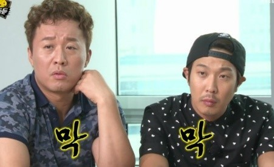
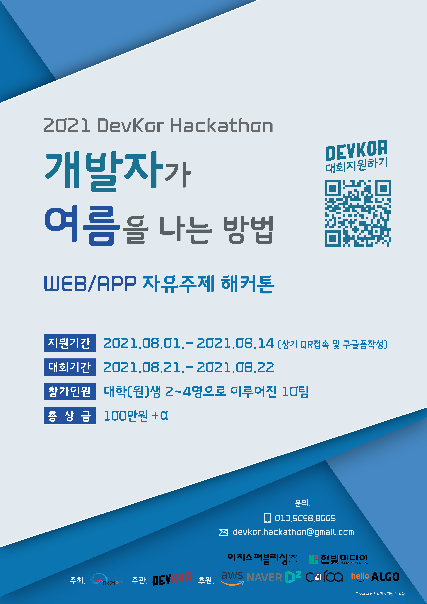
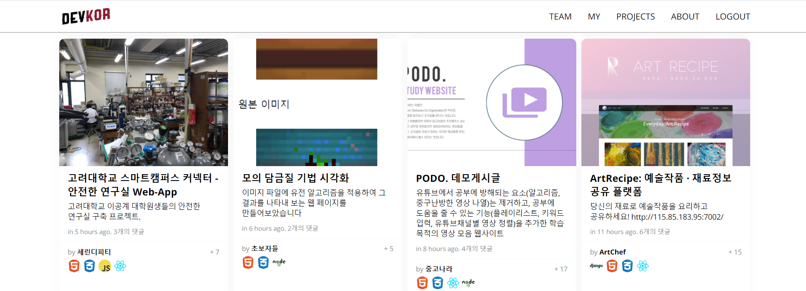
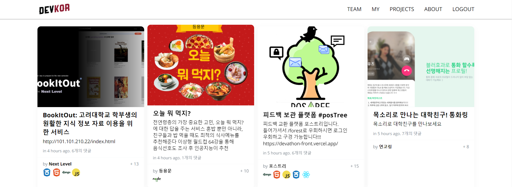
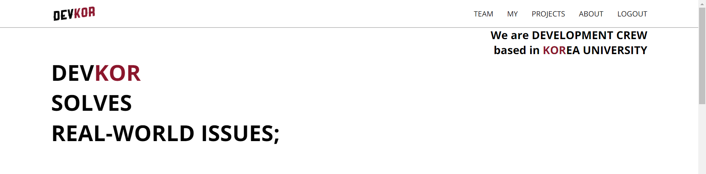

결과물이 궁금하시다면, [여기](https://devk.or.kr/)에서 확인해주세요:)

> 1달 전: 나름 명색이 개발 학회/동아리인데 해커톤 한번 해야지!  

> 1달 후: 아이고 호진아..ㅋㅋㅋㅋㅋㅋㅋㅋㅋㅋ

2021년의 여름방학은 해커톤이라는 행사 하나로 요약할 수 있다. 어떻게 온라인 해커톤을 주니어 개발자도 개최할 수 있었을까? 케이스를 남길겸 회고해보자.

## 시작을 어떻게... 해야하지?

해커톤은 몇번 참여를 해봐서 상금도 좀 받았었는데... 어떻게 돌아가는지는 알았는데... 막상 기획자의 입장에서 기획을 해보니 이게 진짜 쉬운게 아님을 뼈저리게 느꼈다. ~~너무 많이 뼈저리게 느끼는데?~~

### 우선 하던대로 해봤다

> 나는 이제 야매 기획자!

*없는게 없는 github...*
정말 좋은 [레퍼런스!](https://github.com/KMU-OSS-Laboratory/Hackathon-Manual/blob/master/manual.md)를 찾을 수 있었고, 우선 이걸 토대로 여러가지 것들을 매주 운영진들과 기획하기 시작했다.

동아리에 다행히 디자인을 하시는 분이 계셔서 요청을 드렸더니 포스터를 흔쾌히 만들어주셨고 (사람복 넘치는 정호진)

레퍼런스를 토대로 운영 매뉴얼, 평가 기준 정하기, 식비 지원을 위한 기프티콘 구입 등 대회 진행을 위한 필수적인 부분들을 채워나갔다.

### 조언도 구해봤다

사실 이때가 세미나에 대한 회의감으로 가득차 있을 때라 자신감이 무척이나 떨어져 있던 시기였다. 그래서 동아리를 운영했던 초기에 이 동아리(이때는 개편전)를 운영했던 회장단 님들께 여러 팁을 구할 수 있었고 정말 큰 도움이 되었다.
스티커 도안도 받아서 ~~재활용~~도 해볼 수 있었다 ㅎㅎ 진짜 이걸 처음에 기획했던 분은 얼마나 많은 고생을 하셨을까... 상상도 할 수 없다. 그저 존경스럽다😎

도움들을 받고 해커톤 전날까지 운영진들과 밤늦게 대회에 대한 기획을 진행했다. 그럼에도

## 발품을 팔아보자

그럼에도 해커톤에서 제일 중요했던 부분이 있었으니.. 바로 후원을 따내는 것이다. 1박 2일동안의 식비, 서버비, 이벤트 경품 등 모든것이 돈이다. 해커톤하면서 이 문제로 제일 스트레스를 많이 받기도 했고, 나는 돈을 직접적으로 관리하는 작업에는 익숙치 않구나를 깨닫기도 했다.

후원금을 받으려 몇가지 루트(?)로 접근했다.

### 1. 콜드메일
기업에게 후원 의사를 묻는 콜드메일을 

나름 또래 치고는 이메일을 보내는거에 익숙한 편이라고 생각했는데, 이메일을 보내느라 한시간 넘게 고민한적은 처음이다. 
* 이렇게 보내면 너무 속물적으로 보일까?
* 아니 근데 결국 비즈니스면 솔직하게 말해도 되지 않을까?
* 사회성이 부족한건가.. 주륵

결론은 적당한 예의와 확실한 비즈니스 밸류를 지니고 있으면 되었다. 구글 검색을 통해 해커톤을 후원해주었던 여러 기업들을 찾아다녔고, 그 기업들에게 모조리 후원 메일을 넣었다. 그 중 다행히 답변이 긍정적으로 온 기업들이 몇군데 있었다. 이를 통해 기념품, 참가자용 서버 등을 후원받을 수 있었다.

### 2. 이것이 인맥..?
> AWS요..?!

여름방학에 랩실에서 인턴으로 지내고 있었는데 지푸라기라도 짚는 심정으로 교수님께 요청을 드렸다. 그런데 너무 쉽게도 교수님의 지인을 통해 후원금의 상당수를 조달할 수 있었다.

우선 BK21 사업단으로 선정된 연구단이 있었는데, 마침 이곳에서 해커톤 성격의 대회에 후원할 수 있도록 찾고 있었다고 한다.

주관을 해당 연구단으로 하는 것을 조건으로 상금과 서버비 일부를 후원받을 수 있었다.

연구단에 계신 교수님 중 지인이 AWS(Amazon Web Service)에 근무하고 있는데 우리 행사에 지원해줄 수 있다는 소식을 들었다. 외국계 회사이기도 해서, 진짜 생각도 못했다. AWS에서는 여러가지 회사 경품들을 지급받을 수 있었다.

나 -> 교수님 -> 연구단 교수님 -> AWS 다니시는 분  
어-썸한 흐름 아닌가..? 나도 나중에 사회적으로 영향력이 생긴다면 이 분들처럼 나누어주고 싶다.

### 3. 이것이 인맥..? season 2

동아리에서 인공지능(딥러닝)을 가르쳐줬던 선배님이 나가서 스타트업의 초기 멤버로 일하고 계셨는데, 선배를 통해 회사에서 꽤 많은 금액을 후원받을 수 있었다. 대표님 정말 감사합니다. ㅠㅠ [Corca AI](https://www.corca.ai/) 많관부!!! 흥해라!!! ~~기회가 된다면 저도 지원하고 싶습니다...~~

사실 후원 과정에서는 세금문제가 껴있는 경우가 많아서 골머리를 앓았었는데, 이부분까지 의논해서 선뜻 후원을 해주시니 일이 너무 편했다. 왜 이 스타트업에 다니는 친구들이 대표님을 칭찬하는지 알겠더라... 짧은 기간이었지만 비즈니스적으로 배운게 있었다.

*대회 후에 스타트업으로 가신 동아리 부원 분이 있었으니, 결과적으로는 서로 윈윈이 되었다.*

### 생각보다 좋게 봐주셔서 감사했다

초기에 해커톤을 기획할때 가장 많이 고민했던 부분이 막상 현실에 나가보니 그렇지 않은 경우가 많았다.

> 우리 대회가 뭐라고 우리한테 후원을 해주는거지..?

결국 후원을 받기 위해서는 그에 상응하는 가치가 우리 대회에 있어야 한다고 생각했다. 직접 컨택을 해보기 전에는 그 수요를 파악/예측하기가 어려웠기 때문에 직접 부딫혀보면서 우리의 가치를 파악했다.

앞선 과정을 거치고 몇가지의 가치를 알 수 있었다.
1. 주니어 개발자의 수요(대회를 통해 채용에 성공한 케이스가 있었다) 
2. 개발 커뮤니티에 기여할 수 있는 기회
3. 어린 친구들이 뭐라도 해보려니 이쁘게 보인다..?
4. 이런 대회에 후원을 해준다는 것 자체가 기업/기관에 이득이라는 것.

*사실 3번은 확실하진 않고 ㅋㅋㅋㅋㅋ 내가 어른이라면 그렇게 보일 것 같았다.*

## 대회 당일 - 쉴 수 있다고? 어림도 없지

막상 대회 당일이 되면 일이 별로 없다고 한다. 실제로 그랬...으면 좋겠지만 결국 밤을 셌다. 왜 나는 대회만 하면 잠을 못자는거냐.. 

하지만 기획자의 신분으로 모든 권력을 손에 쥐고 참가자들의 멋진 기획안, 중간 결과물, 최종 결과물을 볼 수 있었다.

해커톤을 위해서 해커톤용 웹사이트를 동아리 내에서 개발하고 있었는데, 막상 서버에 배포해보니 정말 많은 오류가 있었다... 여기는 기술블로그가 아니니 자세한 내용은 생략하자. 여튼 이 오류를 고치느라 잠을 2시간도 못잤다.. 왜 저는 매 해커톤마다 밤을 세는걸까요 ㅠ

### 그래도 정말 정말 정말

**뿌듯했다.**

진짜 뿌듯했다. 정말 정말 정말. 이과생이 정말을 3번 쓴다는건 엄청나다는 뜻이다. 지금부터 그런거니 이의는 받지 않겠다.

1. 우선 참가자들의 결과물 하나하나를 자세하게 볼 수 있었고, 아이디어가 빛나는 결과물들이 정말 많았다.
    
    
2. 내가 만든 웹사이트를 많은 사람들이 쓰고 기록을 남기는것 같아 뿌듯함 그 이상의 감정을 느낄 수 있었다.
    
    * 개발자, 매니저로서도 큰 성장을 할 수 있었고, 이때의 경험이 지금 창업을 준비하고 있는데 큰 도움이 되고 있다. (CTO 생존기도 기대해주시라)
3. 해커톤의 수상한 사람들 중 대다수가 동아리 소속 사람들이었다.
    * 세미나를 했던 것이 헛된것이 아니었구나!! 하며 기뻐했던 적이 있다. 
    * 솔직히 말하면 동아리에서 팀을 임의로, 너무 늦은 시간에 해주어서 수상은 기대하지 않았다. 근데도 해내다니...
    * 세미나를 진행하면서 고생해서 힘들었던 것들이 다 풀리는 순간을 경험했다.
4. 마지막에 피드백을 받았는데, 정말 좋은 말들을 많이 해주셔서 집가면서 조금 울었다.
    * 뭐요, 운게 뭐 어때서요 -3-

### 아쉬운 점

분명히 성공적으로 대회를 진행했지만 여전히 보완할 점들은 남아있다.
1. 수상
수상을 위해서 PPT를 제작했는데, 진행 속도를 맞추지 못하고 PPT가 넘어가버린 덕분에 얼렁뚱땅 수상이 끝나버리게 되었다. 실제 피드백때도 나온 사항이기도 해서 다소 아쉽다. 수상을 할때 그 특유의 긴장감을 더 고조시키지 못한 아쉬움이 남는다. 결국 운영진끼리 모든걸 진행했기 때문에 당연히 전문적인 진행과는 거리가 있을 수 밖에 없다. 
2. 상금처리
세금처리를 미리 생각하지 않아 일부 상금이 적게 지급되었다. 해커톤을 포함한 공모전에서의 상금은 기타소득으로 취급되어서 20%!!!!의 세금을 내야한다. 인간적으로 너무 많지 않나... 생각이 들긴 하는데 나라의 사정이 그렇다니 뭐 어쩔수 없지. 다음 대회에서는 이런 사항들을 미리 알아두고 상금을 조정했으면 한다.

뭐 그래도 잘 끝냈으니깐! 다음 해커톤때는 (다음 회장이) 더 잘 하겠지 ㅎㅎ

진짜 최선을 다했기 때문에 아쉬움은 아쉬움으로 남겨놓자.

### 마무리 - 결론적으로는 전화위복의 계기가 되었다.
1학기에는 내 자신에 대한 의심이 꽃피는 시기였다면 다시 이를 극복할 수 있는 행사였다. "동아리 하길 잘했다" 라고 생각했던 뜻 깊은 순간중 하나이다. 이를 통해 2학기에 잘하는 분들을 동아리로 모실 수 있기도 했고, 2학기까지 동아리에서 활동하기로 결정한 분들도 많아보였다. 

역시 존버는 승리한다.
