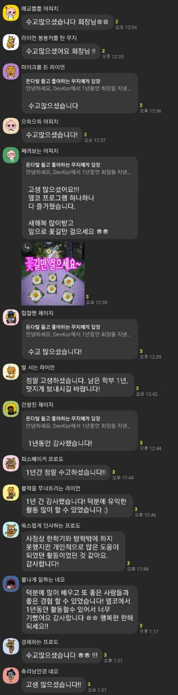

드디어 이 에피소드를 끝마칠 수 있게 됐다. 내년도 회장님께 회장 자리를 물려드렸고 동아리의 모든 행정 처리를 마무리 했다. 사실 몇달 전에 일은 다 끝났는데 귀찮아서 빈둥대다가 개강 시즌이 되니 글로도 마무리는 해야 할것 같아서 기록을 남긴다. 내가 동아리를 운영하며 배우고 깨달은 것들을 다시한번 되짚어보고 나의 과거로 남겨두고 기억날 때마다 다시 찾아오려 한다. 

### 내가 모두를 만족시킬 수는 없다

우리 동아리는 다소 빡세게 운영됐다. 운영진에게도 부원에게도 빡센 동아리였다. (이런걸 보통 학회라고 부른다는 것을 알게 된것은 동아리 운영 중간의 이야기...) 그러다 보니 중간에 나간 부원들도 꽤 됐다. 심지어 첫주에 나간 사람도 있었다. 처음에는 이걸 받아들이기가 힘들었다. 한분 한분이 나에게는 동아리를 유지할 수 있는 이유였기 때문이다. 그리고 내가 이분들의 기대를 충족시켜주지 못했고, 능력이 부족했기 때문이라는 생각이 들었다. 

하지만 1년의 활동을 통해 느낀 점이 있다면 결국 내 생각에 동의하는 사람은 조금 엉성해도 잘 협력해주고, 아닌 사람은 무슨 짓을 해도 같이 가주지 않는다는 것이다. 

### 사람에게 실망했다면 그건 그 사람만의 잘못은 아니다

그리고 나는 내 자신이 만족하지 못하는 상황에서는 생각보다 스트레스를 많이 받는다. 특히 사람과의 관계는 내 노력많으로는 해결되지 않는 무언가(타고난 궁합?)의 비중이 크기 때문에 스트레스를 더욱이 받는다.

처음에는 "왜 내가 원하는대로 열심히 해주지 않지?" 라며 답답하기도 했다. 하지만 시간이 지나고 생각해보니 각자에게 중요한 것들이 있었기에 이런 어쩔 수 없는 상황이 벌어졌다고 생각했다. 내가 원하는 유형의 사람들이 있는 곳으로 가기 위해서는 내가 그만큼 노력해야한다. 시스템이 그런 사람을 좋아하는 곳 말이다. 예를 들어 채용 절차에서 커뮤니케이션적인 부분을 중점적으로 본다든지 책읽는 취미를 가진 사람을 찾기 위해 북클럽에 간다든지 말이다.

### 난 나름 잘해왔다

마지막이 다가오자니 감정이 북받치더라. 단체 잡담방에 글을 남겼고 (술 한잔 마셨습니다..) 그래도 최악의 회장까지는 아니었구나 라는 생각이 들었다. 1년동안 더 나은 사람이 된 기분이 든다. 진짜인진 모르겠지만 아무튼 많이 배웠다.

좋은 것들은 발전시키고 아닌 것들은 개선하며 나를 양분삼아 다음에는 더 좋은 학회(이제는 동아리에서 학회로!)가 되었으면 한다. 10년 뒤에 성공한 선배로 딱 와서 후원해주는 사람이 되고 싶다. 꼰대는 이만 물러가겠다.
