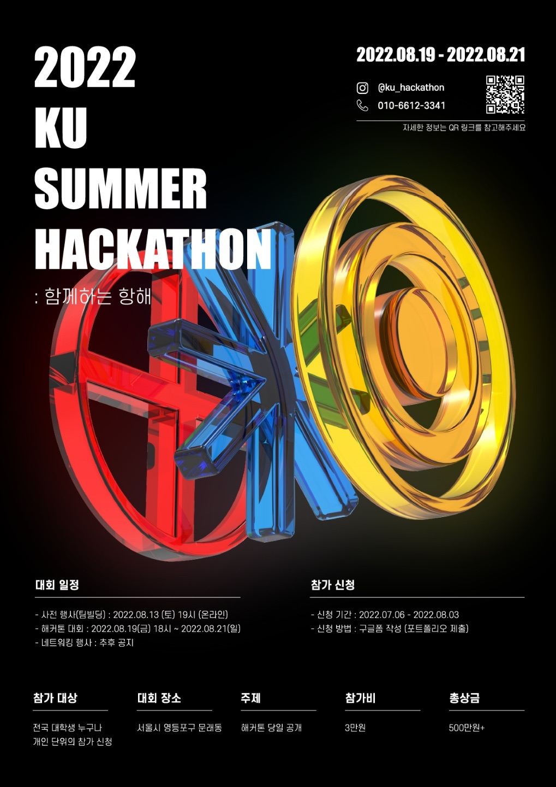
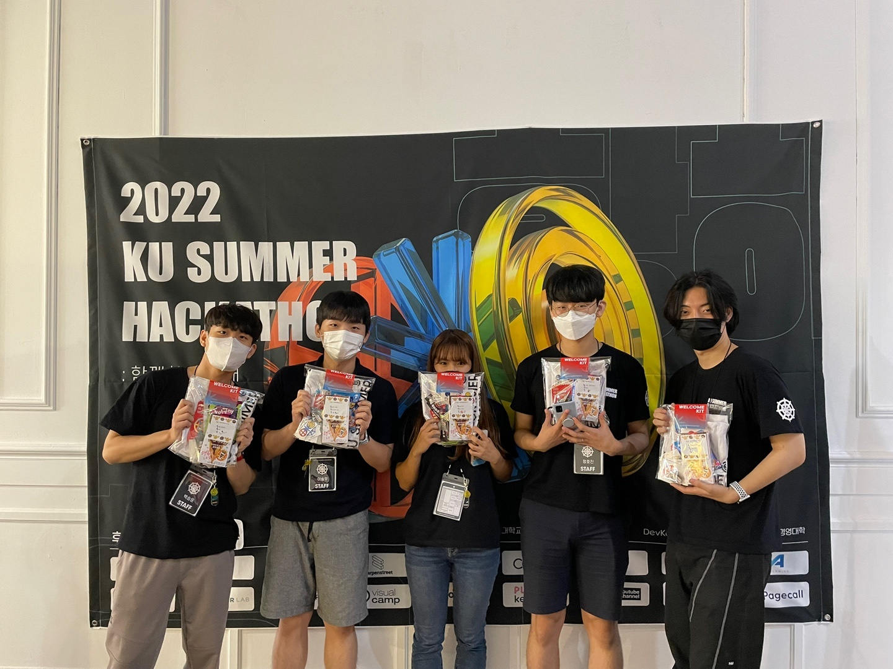
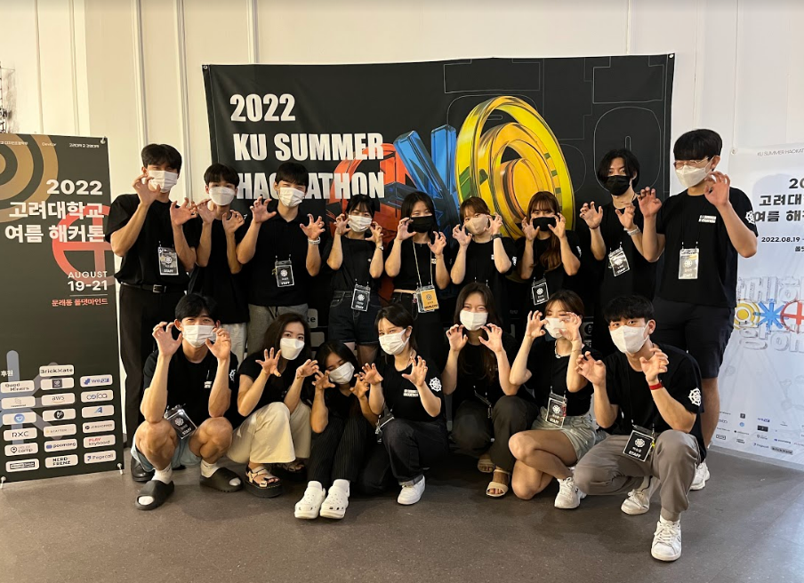
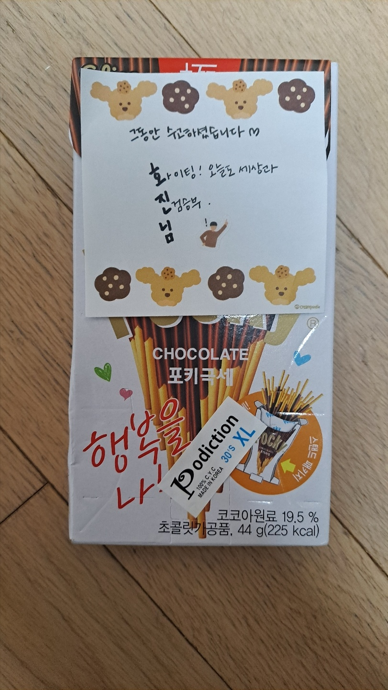

부제: 2022 KU Summer 해커톤 운영진이 되보았다.

## TL;DR
방학동안 2022 고려대 해커톤 운영진이 되보았다. 재밌었다^~^    
[https://connecthon.com](https://connecthon.com/) 한번씩 둘러보고가~

## 들어가며
해커톤이 끝난지 1주일이 되어간다. 이정도면 치열하고 설렜던 감정도 가라앉아 정리됐겠지 하며 글을 남겨본다. 이게 왜 회장으로 살아남기 에피소드에 있을까? 이번년도에 뎊코에서 해커톤을 주최했기 때문이다! 우리가 단독으로 한건 아니고 디조, 경영대 측 학생회 분들과 함께했다. 포스터 때깔좀 보세요... 엉엉 후원 기업 수좀 보세요...엉엉 ㅠㅠ. 

해커톤을 준비하는데는 많은 노력과 시간이 든다.(작년 회고록) 많은 분들이 기업 컨택, 커뮤니케이션, 장소 대관, 행사 진행, 굿즈 및 웹사이트 제작 등등..여러 일을 나누어 했다. 난 그 중에 뎊코에 계신 분들과 웹사이트에 쓰일 인프라를 구축 하고 백엔드를 개발했다. 백엔드! 실제 프로덕션 단계까지 맡아서 해본건 처음이었지만 왠지 잘할 자신이 있었고 나름 무난하게 해낸거 같다. (프론트에 비해 백쪽 로드가 많지 않았던 이유도 있겠다)

이번 해커톤은 웹개발에 관한 지식을 검증하는 느낌이라 기술적으로 많은걸 배운건 아니었지만, 그럼에도 이런 행사에 참여하면 매번 새롭게 느끼고 얻어가는 점들이 있다. 그게 뭔가 하냐면...

## 뭔가 하냐면...

### 1. 좋은 사람들을 많이 만났다

가장 크게 얻어가는게 있다면 그건 바로 인간관계일 것이다. 좋은 동료이자 사람들을 만난 것 같아 기쁘다.

해커톤 총괄이자 프론트엔드 개발자였던 수진이는 이번 대회에 가장 고생한 사람인것 같다. 해커톤 중간에 개발에만 집중할 수 있도록 일을 분배해줘서 개발하는 입장에서 너무 고마웠다. 정작 본인은 진행하랴 개발하랴 중간에 다른일 하러 불려것 같아서 더 고마웠다. 그저 빛... 눈부셔!

프론트엔드 개발자인 승우형은 이번 대회에서 처음 만난 사이다. 사실 내가 매번 농반진반으로 승우님 "이거 오류나요 일해라 으하하"라고 괴롭힘같은 피드백을 많이 준거 같은데 매번 반영해주어서 고마웠다. (해커톤 공노비가 아니었나 싶은) 해커톤이 끝나고도 열심히 마무리를 하는 모습이 멋졌다. 

백엔드 개발자인 정훈이도 이번 대회를 통해 처음 만나 같이 백엔드 개발을 했다. 최소한의 의사소통(회의가 10분을 넘은적이 없던 것 같다)으로 맡은 일을 기간안에 해주는게 같이 개발하는 입장에서 너무 편했다. 개발자는 역시 T가 좋다고 생각한 INFJ였다.

행사진행 담당인 승윤이는 고등학교때부터 알던 사이여서 편하게 일할 수 있었다. 낮선 장소와 사람들 사이에 편한 사람이 있다는건 좋은 일이다. 대회 중간중간에 서로 요즘 현생에서 뭐하고 있는지 이야기했다. 서로 비슷하면서도 다른 진로를 찾아가는게 새로웠다.

디조 분들과 경영분들은 해커톤 전부터 많이 만났으면 좋았을 것 같다. 좋은 분들이고 고생을 많이하셨던 것 같은데 나중에 연이 닿아서 재밌는 일 많이 했으면 좋겠다. 뒤풀이때 신선한 이야기들을 많이 해서 재밌었다🤣

### 2. 개발이 다시 재밌어졌다
2021년에 개발을 하면서 상처를 많이 받았다. 같이 개발하던 분은 잠수 타고, 일정에 쫓기고, 코드는 엉망진창... 여러모로 실수도 많이 하고 갈등도 많이 겪으면서 재미가 없어졌던 상황이었다. 사실 이번 개발이 마지막 협업 도전 이었는데 나름 만족할만한 성과를 본 것 같아 기쁘다. 커뮤니케이션도 원활하게 된 것 같고 일정이 조금 미뤄졌지만 상관 없었다. 퀄리티야 학생끼리 하는건데 다 거기서 거기 아닙니까.. 이게 내가 그토록 하고싶었던 협업이었나 싶다. 그래도 아직은 개발을 취미로 할때가 재밌다. 해커톤 많이 나가야지!

### 3. 함께하는 항해에선 선장보단 선원이
조직 안에서 사람들은 리더와 팔로워로 구분된다는 말이 있다. 해커톤의 부제가 함깨하는 항해이니깐 선장과 선원으로 비유해보자. 지금의 난 선장보단 선원이 맞다. 특히 이번 대회에서 개발만 하면서 느꼈는데, 난 심리적으로 안정될 때와 아닐 때의 효율 차이가 막심하다. 안정될때 생산성이 몇십배는 올라가는 것 같다. 심리적 부담감에 다소 취약하다는 약점이 잘 감춰지고 자유롭게 아이디어를 내길 좋아한다는 강점이 잘 드러난 것 같다. 언젠가는 선장이 되어야 하겠지만 지금은 선원이 좋다. 요리도 잘하고 청소도 잘하는 능력 만땅 선원이 하고싶다.

### 4. 이행시로 사람 감동시키는 법을 배웠다
대회가 끝날때 디조 분들이 깜짝으로 준비한 운영진 전용 굿즈 선물을 받았다. 각자의 이름으로 이행시를 해주셨더라. 사람 감동은 이렇게 시키는거구나 싶었다.

### 마치며
4학년 마지막 여름방학을 대가로 내주고 얻은 해커톤이다. 이정도는 되야 해커톤 할 맛이 나지! 내년에 참가자든 운영진이든 또 참여할거다. 다시 생각해보니 운영진은 아닌것 같다. 좀 그래. 참가자로 해커톤이 평일이어도 참여해야지🤔 ~~미리 내년의 대학원 지도교수님께 심심한 위로의 말씀을 드린다.~~
