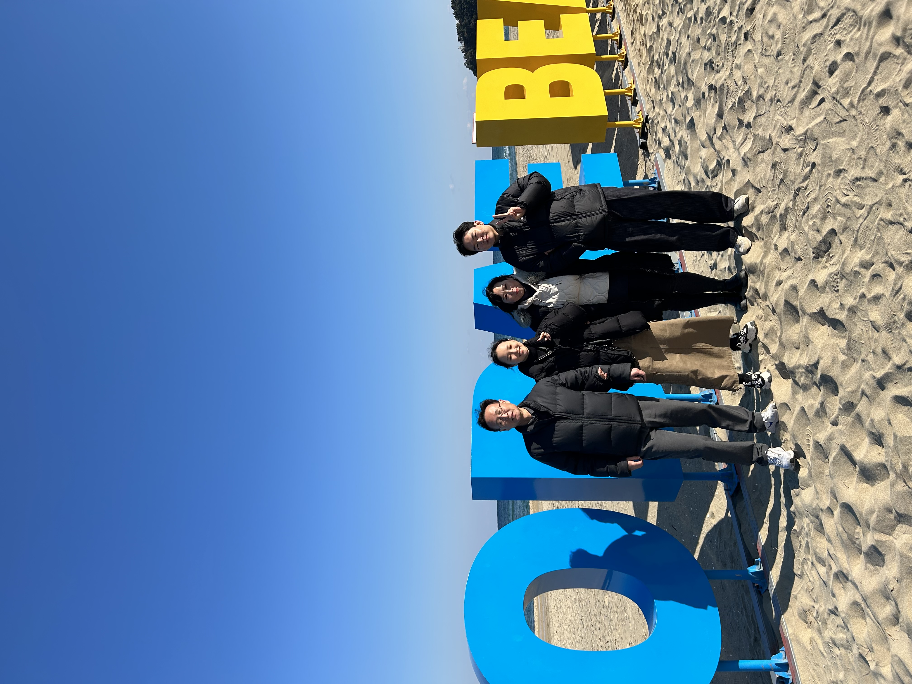
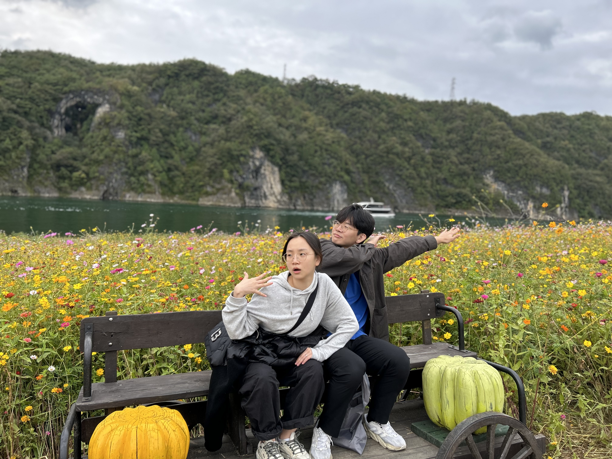

왔다네 왔다네 2024년이 왔다네 회고를 해보자네.

## 연구실

오랜 방황의 끝이자 새로운 시작이다!

이제는 말할 수 있다. 나! 솔직히 개발하는거 자신 없었다! 개발은 하면 할수록 기술도 잘해야 하고 비즈니스도 잘해야 하고 뭔가 내가 잘할거 같은 영역에서 점점 벗어나는 느낌이 들더라 코쓱.. 여튼 대학원에 오게 된 자세한 이야기는 [여기](/posts/연구%20일지/2/)를 보시라 :D

앞으로 내 2년간 목표는 "탑티어 학회에 1저자 논문 2편 쓰기"다. 아무것도 모르는 응애 대학원 인턴이지만 꿈은 크게 가져야지 암. 지금은 용의 꼬리도 아니고 발톱 때에 있는 것 같긴 한데 언젠가는 머리가 될 수 있지 않을까? 나를 믿고 꾸준히 나아가자. Uncomfortable zone을 넘어서 WTF zone에 있는 것만 같은 기분이 들지만... 그만큼 또 성장하는 것 아니겠습니까 ~_~

## 회복

살면서 가장 큰 압박감과 스트레스를 받고 있는 요즘인 것 같다. 공부만 하면 진짜 큰일날 것 같아서 뭐라도 환기를 시키려고 발버둥을 치는 중이다.

### 사람들

대학을 졸업하고 나니 이제는 가만히 있어도 누군가가 와서 말을 걸어준다거나 같이 밥을 먹으러 간다거나 하지 않는다는걸 깨달았다. 진심으로 이제는 원한다면 하루종일 한마디도 안하고 쭉 방에 있을 수 있다. 그래서인지 요즘은 사람 만날 기회가 있으면 어떻게든 만나보려고 하고 있다. 연애? 그런거 모르겠고 요즘은 그냥 사람 만나는게 좋다. 대학 다닐때만 해도 사람 만나는게 좀 귀찮고 무서웠기도 했는데 이제는 딱히 그렇지도 않고 재밌으면 재밌고 안맞으면 말고 요런 느낌이라 좋은것 같다. 2024년에는 좀더 적극적으로 살아보자.

### 여행

하반기 들어서 가족과 보낸 시간이 참 많아졌다. 1년 1년 지나갈수록 가족의 소중함을 느끼게 된다. 요즘 같이 여행도 많이 갔다와서 참 좋다. 놀러가서 맛있는 거 많이 먹고 수다 떨고 하는거 참 재밌다. 작년부터 갑자기 장례식을 많이 갔다왔는데, 그럴수록 가족과 같이 있는 시간들이 소중해지는 것 같다. 앞에서는 이런거 말 안하고 여기다 몰래 써놓을거다 ㅎ

### 취미

개발을 할때는 취미가 일이었던거 같은데 연구를 하면서는 그럴 시간이 없는건지, 취미로까지 하고싶지는 않은건지.. 암튼 잘 모르겠당. 잘 쉬는 것도 능력인데 나는 혼자 있을 때 그걸 잘 못하는 것 같아서... 뭐라도 해보면 익숙해지겠지 싶어서 취미를 새로 배워보기로 결심했다. 몇가지 규칙들을 만족하는 선 안에서 취미를 골라보았다.
1. 짧은 시간 안에도 끝낼 수 있을 것
2. 언제든 시작해서 언제든 끝낼 수 있을 것
3. 컴퓨터를 쓰지 않을 것
4. 내가 재밌을 것

그렇게 테니스와 노래를 시작했다!

#### 테니스

매주 두번 30분씩 동생하고 테니스를 치고 있다. 동생이랑 무언가를 꾸준히 같이 해보는건 좀 처음이라 걱정을 좀 했는데 벌써 4개월이 넘었다. 운동 자체도 어려워서 성취감도 있고 다른 사람들하고 친목 쌓기도 참 좋은 운동인것 같다. 이때 안 배웠으면 코르카 사람들이랑 테니스도 못 쳐봤을테니 시작하길 잘한것 같다. 서브까지 배우고 많이 늘면 동호회 같은 곳에 가서 도장깨기 해보는건 어떨까 생각도 해보고 있다. 동생은 손끝 감각이 좋고 나는 포지셔닝을 잘하니 복식하면 딱 맞겠군!

#### 노래

할까말까 수백번 고민하던 보컬 레슨을 시작했다. 노래 잘부르는 사람에 대한 동경심도 있고... 무엇보다 내가 원하는 곡을 부를 수 있게 된다는게 참 멋진 것 같다. 어쩌다 보니 여기 학원에서 동호회도 같이 하게 되었는데 다들 좋은 사람들 같다. 좋은 인연도 많이 만들어서 노래 같이 부르러 다니면 진짜 재밌을 것 같다. 나만 잘하면 되겠구만 ~_~
