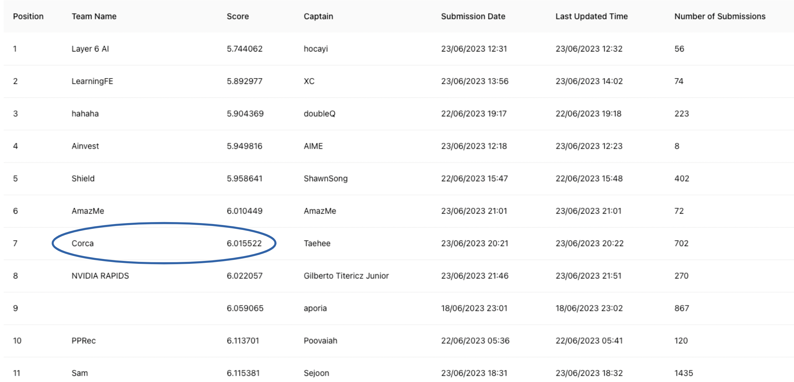
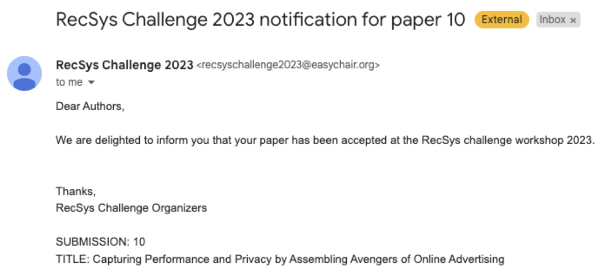
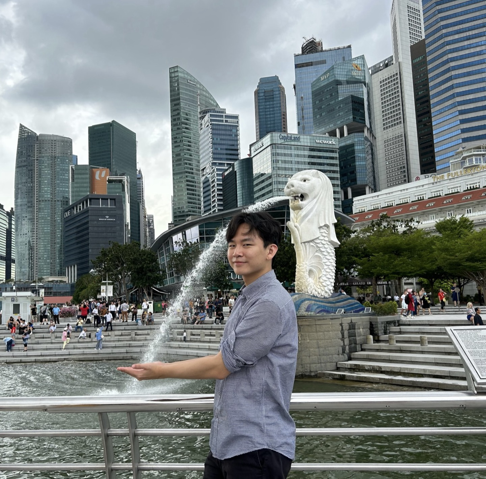
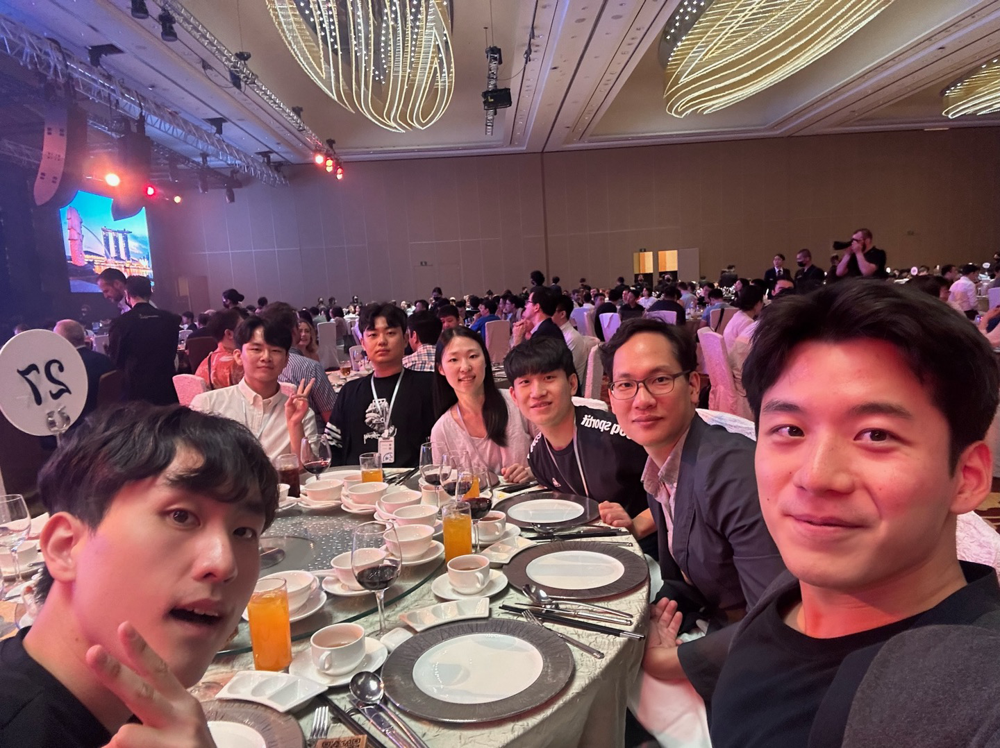

## 대회를 나가보자

3월 어느날, 태희님이 처음 이야기를 꺼냈던 것 같다. RecSys 학회에서 주관하는 대회가 있는데 참가할 생각이 있냐고 물어보셨다. 바로 하겠다고 했다. 평소에 개발만 하느라 지루함을 느끼고 있기도 했고, ML 지식이 어느정도 쌓여 있을때 나가는 대회는 어떨지도 궁금했다. 무엇보다도 엔비디아, 인텔 등 대기업과 대결할 수 있다는 사실이 너무나도 기대됐다. 동양의 한 스타트업에 다니는 SW Engineer는 세계 몇 등일까 궁금했다. 당연히 이길 가능성은 낮아보이지만 길고 짧은건 대봐야 알지 않겠는가. 말이 씨가 되길 바라면서 "우리 1등할건데요?" 라고 농담하기도 했다. (영현님 포함 다른 사람들은 진심으로 받아들였던거 같아서 문제였지만...)

4월 중순부터 시작한 대회는 난관이 많았다. 우선 주최측이 리더보드를 엉망으로 짜놔서 등수와 점수가 몇번이고 리셋되는 참사가 일어났다. 우리의 마음도 등수따라 요동쳤던건 덤. 별개로 나 자신도 좀처럼 성적이 안나와서 머리를 자주 부여잡았다. 특히 초반에 삽질을 많이했다. 익숙하지 않은 도메인에서 처음부터 끝까지 구현하려고 욕심을 부리다 보니 속도도 느렸고 뭐가 중요한지 갈피를 못 잡았다. 다행히 같이 참가한 회사 동료분들이 초반에 점수를 잘 끌어올려 주었다. 덕분에 마음놓고 슬로우 스타트를 할 수 있었고, 시간이 지나서는 결국 나도 유의미한 기여를 할 수 있었다!

주말과 평일 저녁을 반납하고 6명이서 합숙에 가까운 생활을 하던 중... 어라 이거 할만하네? 각이 보이기 시작했다. 우리는 각자 도생하면서 얻은 팁들을 공유하곤 했는데, 각자가 서로 좋은 영향을 주고 받으며 점수를 올리기 시작했다. 한 사람이 점수를 올리면 짧은 시간 안에 다른 사람들이 그 점수를 따라잡았다. 큰 폭의 변화는 없더라도, 하루 하루 꾸준하게 올라갔다. 한명 한명이 혼자서 대회를 나갈 수 있는 실력이 있으니 가능했던 전략이었다.

> 대회 끝나가는데 우리 5등 안쪽인데?

대회가 마무리되기 전 한주는 정말 힘들었다. 어떻게 지냈는지 기억이 잘 안난다. 자나깨나 생각을 하다보니 뇌가 쉴 틈이 없었다. 회사에서 동료분이 말씀하시길 밥먹다가 졸았다고 한다. 믿거나 말거나... 대회 끝나기 1분 전에는 다 같이 모니터 앞에서 카운트 다운을 외치기도 했다. 새해 카운트 다운보다 상쾌했던 것 같다.

## 결과

결과적으로 대회는 7등으로 마무리했다. 한국에서는 삼성 포함 다른 기업을 제치고 1등이다. 엔비디아는 8등했다 ㅎ. 후일담으로 엔비디아는 다른 대회(KDD) 가서 1등 했다지만 ㅎㅎ... 어쨌든 당당하게 외칠 수 있다. **코르카 밑에 엔비디아!**

## 자 논문을 써보자

보통 해외 학회에서 주최하는 challenge를 나가서 좋은 성적을 거두면 솔루션 논문을 쓰고, 이걸로 학회에 참석할 수 있다. 이번 년도 RecSys는 싱가폴에서 예정되어 있었다. 논문을 쓰면 싱가폴에 간다는 말이다. 

차분히 논문을 쓸만한 등수인지 각을 보았다. 매년 10팀 정도가 논문에 붙었다. 우리 7등이네? 논문 각이 섰다. 이때 회사를 막 나와서 대학원 인턴을 하고 있던 상황이라 참여하기 곤란할 수도 있었지만.. 어떻게 시간이 나서 회사에서 같이 밤새서 논문을 쓸 수 있었다. 팀 전체가 다 달라붙어서 ~~태희님 감독 하에~~ 썼다. 서로 맡은 파트가 다르다 보니 좀 빠르게 썼다. 영어를 잘하건 못하건 다같이 영차영차 썼다. 그렇게 제출한 논문은.. 

별다른 리비전 없이도 붙었다! 워크샵이라 그런건지 모르겠지만 아무렴 어떠하냐. 논문 붙어서 싱가폴 가게 됐는데!!! 학회를 붙은것이 좋은건가 싱가폴을 가는것이 좋은건가. 아무래도 싱가폴이 훨씬...

## 그렇게 싱가폴에 갔다.

9월 18일부터 9월 22일까지 싱가폴에서 Recsys 2023에 참가하는 것으로 대회를 마무리하고 있다. 학회는 생소하고 재밌었다. 구글, 아마존, 넷플릭스, 메타, 화웨이 등등.. 여러 기업에서 와서 자기들 기술 발표하고 이런저런 이야기하는게 너무 신기했다. 서로 다른 국적과 다른 배경을 가진 사람들이 한 관심사를 가지고 모인다는게 참 멋지다. 뿐만 아니라 서로의 연구, 제품이 발전할 수 있도록 영감을 주고 받으니 이보다 즐거운 일이 있을까?

## 마지막으로..

항상 느끼는 거지만 코르카 사람들 참 따숩다. 준홍님, 태희님, 승윤님, 태호님, 태현님과 대회 기간동안 같이 고생할 수 있어서 너무 좋았다. 한명이라도 없었으면 우리가 싱가폴까지 올 수 있었을까 싶다. 회사 나간 대학원 노예도 싱가폴 올 수 있게 해주어서 너무 고마웠다. 비록 이제는 회사를 나와서 더 이상 일을 같이 하지도, 매일 아침 인사를 하지도 못하겠지만 나한테는 너무 소중한 인연들이라 어떻게든 앵겨볼 생각이다. 가끔 불쑥불쑥 들러도 받..받아줄거죠?
