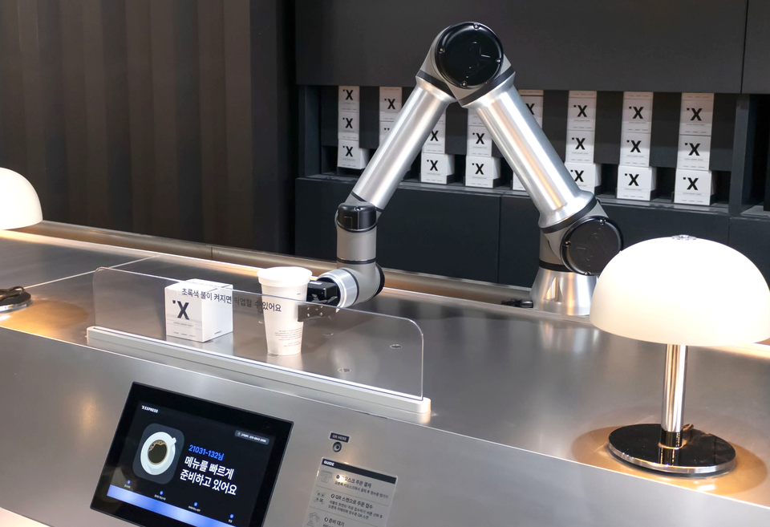
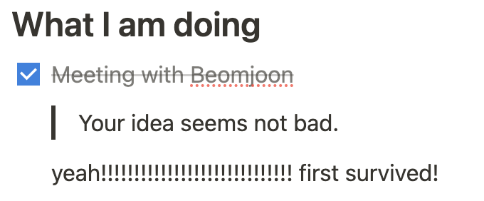
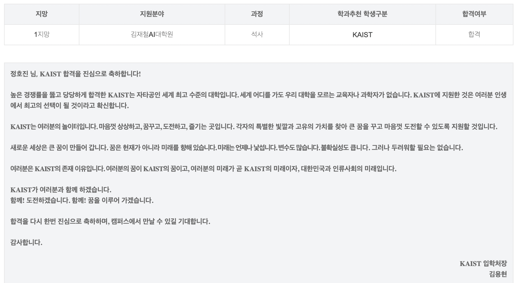

실험하다가 번아웃 와서 극복해보려고 쓴 후기글.

대학원은 7월 첫 평일에 합류했다. 마지막 출근이었던 6월 30일이 워크샵이어서일까 아니면 대학원에서의 첫 주가 충격이어서 였을까.. 아무튼 날짜가 아직도 기억난다. 원래 이런건 잘 신경쓰지 않는데 말이지.

## 그대는 왜 그런 선택을 했나요

아는 사람이든 모르는 사람이든 사람을 만나서 "대학원 다녀요" 하고 말하면 "아..."를 들을 수 있다. 아니 나 아직 입학도 안 했는데... 물론 일은 하지만.. 아 그럼 더 안 좋은건가? 여튼 대학원을 가기로 한 것에 대해 변명?을 하자면.. 다른건 몰라도 "일"에 있어서는 내가 주도권을 가져가고 싶었다. 남을 위해서 일하기 보다는, 나를 위해서 일을 하고 싶었다. 그리고 연구자는 그 방향을 이루기에 제일 적합한 직업이 아닐까 했다. 이런 고민을 하던 중에 왕십리에 있는 무인 카페를 지나갔다.

이런 말 하기 뭐하지만 이거 보면서 가슴이 뛰었다. 아 나도 이런거 만들고 싶다. 할 수 있을거 같은데? 이거 있으면 사람이 일을 안해도 되잖아? 그래서 관련 연구를 하는 연구실들을 찾아봤고, 컨택 후 인턴으로 합류했다. 연구실도 마침 서울에 있어서 아싸 하고 지원했던 기억이 난다.

## 과격한 적응을 했다

첫주에 꽤 새로운 사실을 많이 알아냈는데, 그건 1) 연구실에서 영어를 쓰는데 영어를 진짜 진짜 못한다... 2) 쥐똥만한 지식으로 연구를 하겠다고 왔구나 3) 나 말고도 인턴이 겁나 많다 4) 흠 나 짤릴수도 있겠군 5) 근데 나 회사든 학교든 돌아갈 곳이 없네?!였다. 이보다도 나쁜 스타트가 있을까 싶긴 한데 지금은 다 지나간 일이니까...^^* 솔직히 말하면 인생에서 제일 힘들었던 한주가 아니었나 싶다. 아침에 너무 기운이 없어서 택시타고 가고 점심도 제대로 못 먹기를 반복했다...^^* 환장하겠네...t^^t

그러면서도 매주 미팅을 하면서 피드백을 받아내며 내 지식의 밑천을 드러내야 한다. 인턴인지라 공식적인 카이스트 입시도 준비해야하고 동시에 랩실에 내가 같이 일할만할 사람이라는걸 증명해야했다. 2~3달 안에 날 증명할 수 있는 **무언가**를 가지고 와야 했다. 오 괜찮은게 하나도 없는걸? 최악의 경우를 생각해서 다 내려놓고 군대가는 것도 생각해봤다.

울면서 일해본건 처음이었다.

## 중꺾마 해보자고

돈으로 해결할 수 있는건 돈으로 해결했다. 코르카 다니면서 번거 여기다 써야지. 연구실 출근 첫날 퇴근길에 전화 영어를 시작했고 학원도 끊었다. 출근할때 컨디션이 안좋다 싶으면 바로 택시를 탔다. 스트레스 관리를 위해 테니스를 시작했다. 출퇴근 시간을 정해두었다. 규칙적으로 살려고 노력했다. 야근을 하려고 하면 속이 울렁거려서 저녁은 웬만하면 집에 가서 먹었다.

그럼에도 다행인 것은... 교수님 피드백이 직설적으로 오지만 온전히 나의 성장을 위해서 해주시는 것이어서 들어도 기분이 나쁘지 않았다는 것. 옆자리에 있었던 인턴 분들과 (비록 매주 한명씩 사라지시긴 했지만...) 점심먹으면서 서로 고민 토로할 시간이 있었다는 것. 불안하지만 스스로의 연구주제에 대해 24시간 고민할 수 있었다는 것. 내 상황을 위로받을 가족이 있다는 것. 연구실에 있는 석사 / 박사과정생 분들이 아름아름 팁을 전수해주었다는 것이었다.

연구 주제를 이해하고 생소한 개념을 배우고 다른 참고문헌들을 찾아보고.. 1달 반만에 겨우 겨우 문제를 풀 메소드를 들고갈 수 있었다. 혼나기만 하던 미팅에서 교수님께 "not bad" 소리를 들을 수 있었다. 그리고선 바로 다음주에 다른 교수님 한분이 이 프로젝트에 합류할 거라고 하셨다. 그래도 이정도면 다른 교수님한테 무언가 보여줄게 있다는 느낌으로 받아들였다.

## 면접

대학원은 대학원 입시를 통과한 후에 자신이 들어갈 랩을 결정짓는다. 마지막 단계인 면접에서 세분의 교수님과 면접을 봤다. 근데... 신기한게 면접을 보는 세분 중 두분이 우리 교수님 다음주부터 합류할 교수님이지 않은가. 두분을 보는 순간 뇌정지가 왔다가 뭐지 제 2의 미팅인가 생각하면서 면접을 봤다. 다행히 연구실에서 했던 일들을 조금 소개할 수 있었고 연구실에서 한달 반동안 배운게 있었기에 이야기할 내용도 충분했다. 마지막에 어필하고 싶은게 없냐고 해서 조금 고민하다가 그냥 하고 싶은 말을 했다. "랩실에서 영어로 하면 잘 못 말할거 같아서 지금 말하겠다. 솔직히 한달 반동안 빡셌지만 진짜 많이 배웠고 면접 결과 상관없이 앞으로도 열심히 하겠다". 교수님들의 표정에서 살짝 미소를 봤던 것 같다. ~~(???: 좋아 걸려들었군)~~

면접 결과는 9월 말에 나왔다. 이때 싱가폴에서 [Recsys 2023](/posts/연구%20일지/1/)에 참가하고 있었다. 마음 싹 비우고! 맛있는거 먹고! 코르카 사람들이랑 공부나 하다가 가야겠다! 라는 마음가짐으로 있었다. 결과 목요일에 나온다고 말하고 싶었는데 떨어지면 동정의 눈길을 받을거 같아서 같이 학회간 코르카 사람들한테도 말 안했다. 워낙 인턴 기간도 짧았고 보여준 것도 적었으니까 기대하지 말자고 했는데 막상 발표 당일날이 되니까 긴장해서 손발에서 땀이 줄줄 났다. 기대 많이 했던 것 같다 ㅎㅎ. 밥 먹던 와중에 잠깐 나와서 결과를 확인했다.

합격이었다. 솔직히 안울려고 했는데 합격 발표 아래 써있는 편지 보고 울었다. 안울려고 했는데!!! 편지가 좀 강력했다. 밥 먹으면서 질질 짰다... 내 이미지 망했네 이거.

## 변한건 없다

그렇게 합격발표를 들고 귀국하자마자 랩에 출근해서 교수님과 개인 면담을 했다. 랩에 공식적으로 합류할 수 있냐고 여쭤봤고 긍정적인 답을 얻을 수 있었다. 쇼앤프루브 해버린거야~ 그렇지만... 아직 노하우나 기본 지식도 부족하고, 어떻게 연구를 해야하는지도 잘 모르는 초짜 인턴이다. 나만의 연구를 할 수 있을 정도로 발전해야겠지? 아자아자 화이팅!

[랩 사이트..ㅎㅎ](https://imsquared.github.io/)
