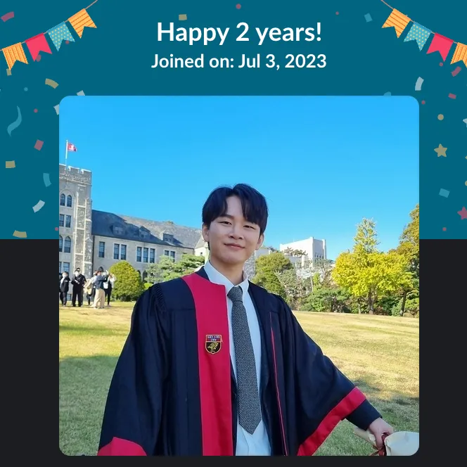

잘 지내셨나요? 저는 어떻게 보면 잘 못 지냈고, 또 어떻게 보면 잘 지냈습니다.

랩에 들어온 지 2년이 되어 가는데, 그동안 연구 주제도 엎어졌다가 다시 시작해서 [논문](http://neuralsvcd.github.io/)을 작성해 제출했습니다. 방금 막 rebuttal까지 끝내고 물 떠놓고 oral되길 기도하는 중... 리뷰 점수가 나쁘지 않음 뭔가 심상치 않음...! 잘 안될 수도 있지만, 스스로에게 “고생했다”고 말해 주고 싶었습니다. 인생에서 나름대로 중요한 순간을 겪은 것 같아 회고록을 쓰고 있는데, 블로그 글을 정말 오랜만에 쓰려니 어색하네요ㅎㅎ..

저는 학부 때는 (보안의 탈을 쓴) 컴퓨터공학과 웹 개발을 중심으로 공부했고, 그 사이에 회사에서 MLOps를 잠깐 하다가, 대학원에 와서는 로봇 소프트웨어를 연구하고 있습니다. 다 코딩이라는 점에서는 비슷해 보일지 몰라도, 대학생으로서의 공부와 대학원생으로서의 연구는 학문적으로도, 마음가짐 면에서도 너무 달랐습니다. 연구 초기에는 그런 차이를 잘 몰라서, 멋모르고 용감하게 덤볐다가 좌절도 많이 하고 멘탈도 많이 나갔어요. 특히 첫 연구 주제가 엎어졌을 때는 그만둘까 고민도 했지만, 꿋꿋이 버티다 보니 결국 괜찮아지더라고요. 이번 회고록에서는 대학원에서 살아남기 위해, 그리고 논문을 쓰기 위해 제가 가장 집중했던 점들을 몇 가지 적어 보려 합니다.

## 이야기꾼이 되자

연구실에서 가장 크게 배운 것은 “과학은 발견의 행위이자 설득의 행위다”([Science is as much an act of persuasion as it is an act of discovery](https://matt.might.net/articles/successful-phd-students/))라는 점입니다. 좋은 아이디어와 실험 결과가 있더라도, 이를 듣는 사람(교수님, 리뷰어, 랩실 동료, 부모님 등)이 이해하도록 전달할 수 있어야 하죠. 연구 스토리에는 다음이 담겨야 합니다.

1. 문제가 무엇인지
2. 왜 중요한지
3. 무엇이 어렵게 만드는지
4. 기존 방법이 왜 실패했는지
5. 우리의 방법이 왜 해답이 될 수 있는지

스토리가 탄탄하면, 논문은 그 내용을 학술적으로 옮겨 적는 과정일 뿐입니다. 그렇지만 머릿속에 뚜렷한 스토리가 있어도 글로 풀어내기는 여전히 어려웠습니다. 첫 연구가 실패한 이유도 결국 커뮤니케이션과 스토리의 부재였던 것 같습니다. 뭔가 잘못돼 가는 걸 느끼면서도 고치지 못했던 건, 애초에 연구의 핵심 서사를 깊이 고민하지 못했기 때문인 것 같아요. 부족함을 절감한 만큼, 이번 연구에서는 “이야기꾼이 되자”는 마음으로 임했습니다.

## ‘되게’ 만드는 것

그다음으로 깨달은 것은, 무엇이든 *되게* 만드는 능력이 중요하다는 겁니다. 첫 번째 연구에서 제가 부족했던 부분이자, 두 번째 연구에서 박사님께 보고 배운 점이기도 해요. 아이디어가 아무리 좋아도 검증이 느리면 소용없습니다. 구현, 최적화, 추상화 등 무엇이 필요하든 빠르게 해내야 합니다. 개발에서는 코드 확장성을 극단적으로 신경 쓰는 문화가 있지만(적어도 저는 그랬어요), 연구에서는 확장성보다 속도가 더 중요합니다. 매주 교수님 미팅에서 “리팩토링했습니다”보다는 “새로운 실험을 했습니다”라고 말할 수 있어야 하니까요. 이 점이 개발자였던 예전의 저와, 연구자로서의 지금 제가 달라진 부분입니다.

## 좋은 문제를 고르는 것

다들 “문제를 해결하는 사람”을 꿈꾸지만, 정말로 *좋은* 문제를 고르려 노력해 본 적이 있을까요? 저 역시 “좋은 문제를 찾아야지”라는 말만 하고, 정작 중요한지 깊이 따져 본 적이 드물었습니다. “모델 구조를 바꿔서 성능이 올랐다”는 데 만족해 버렸던 것 같아요.

좋은 문제를 고른다는 건 결국 이야기꾼이 되어야 한다는 말과 비슷합니다. 이 문제를 풀면 내 분야에 얼마나 큰 발전이 있을지, 내가 풀 수 있을지, 얼마나 걸릴지, 남들은 어떻게 풀고 있는지 등을 냉정히 따져야합니다. 두 번째 연구 주제를 정하는 데만 6개월 넘게 걸렸는데, 매주 새로운 아이디어를 들고 가도 교수님 질문에 답을 못 하고 돌아온 적이 많았죠 ㅎㅎ. 이런 과정을 반복하다 보면 사람이 미칠 것 같지만… 연구자는 좋은 문제를 풀수록 큰 보상을 받는 법이니까 견뎌야합니다.

## 앞으로의 계획

아무튼 저는 이렇게 살고 있습니다. 만약 논문이 붙으면 인스타에 자랑 좀 하고, 학회 참석 후기도 남길 예정입니다! 석사 졸업 후에는 박사과정에 들어가기 전 회사에서 몸과 마음을 정비하려고 해요. 되도록이면 이 분야에 몸을 계속 담구고 싶고, 공부를 계속 하고 싶네요! 그동안 주위에 신경을 잘 못 쓰고 살았던 것 같은데, 기분이 나면 연락을 해볼게요. 사실 안바빠도 연락 잘 안하는거 다들 아시자나요. 여튼 기회가 되면 보아요 안녕!
