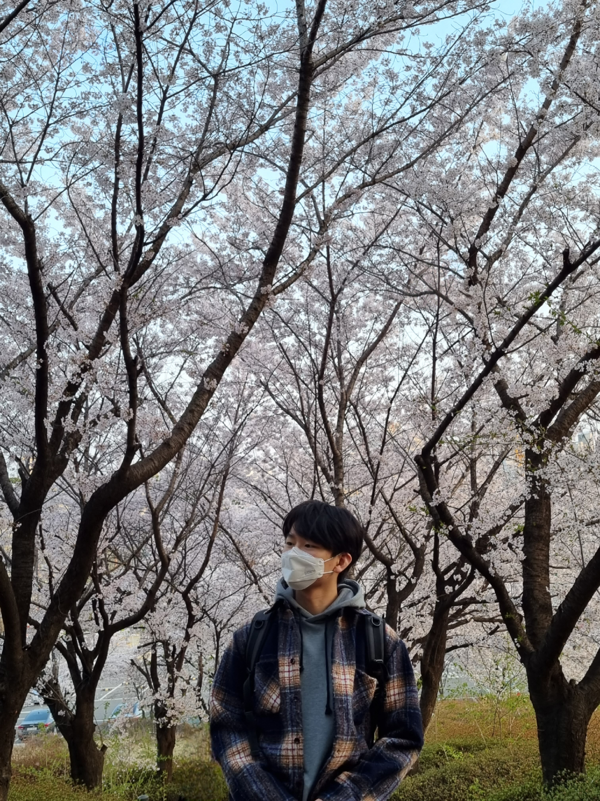

## 4월 4일
오늘 드디어 격리가 풀렸다! 보통은 1교시에 있는 비대면 수업을 집에서 듣지만, 오늘 만큼은 학교에 일찍 가고 싶은 마음에 아침 일찍 일어나 수업을 학교에서 들었다. 물론 학교에 온지 1시가 만에 후회를 하긴 했지만 말이다..ㅎㅎ 집에서 일주일간 갇혀 있다가 나온다는 마음에 급발진을 해버린 모양이다. 그만큼 빨리 종강도 원하게 되었으니 말이다. 종강 원츄...
그래도 좋은 점이 있다면 오늘 날씨가 정말 좋다! 적당하게 따듯한 봄 날씨를 오랜만에 느껴봤다. 건물이 이쁜 문과 캠퍼스쪽에서 수업을 듣는데 수업에 들어가기 전까지 시간이 조금 남아서 햇빛을 쬐었다. 멍때림 + 햇빛은 언제나 행복한 일중에 하나이다. 아무튼 이렇게 햇빛을 쬐고 지금 강의실에 들어와 일기를 쓰고 있다. 지난 일주일간 못갔던 것이 무색하게 지금 무척이나 집에 가고 싶다. 아직 중간고사도 보지 않았다는 사실이 매우 슬프게 느껴진다.
오늘은 나른과 피곤의 그 사이 어딘가에 있나보다. 이만 글을 줄인다.

## 4월 6일
글쓰기 수업에서 자기 소개를 했다. 이번에는 말이 아닌 글로. 매번 이런 글을 쓰고 피드백을 받을때마다 글의 구성 보다는 글의 내용에 피드백을 많이 받는다. 어떻게 보면 글보다 그 속에 담겨있는 나 자신에 대한 생각이 잘 드러나는 것 같아 기분이 좋지만, 반대로 글의 구성이 이런 생각을 잘 전달해주지 못하는 것 같아 아쉽기도 하다.

나는 글 속에 담겨있는 생각도 좋지만 글의 표현과 구성에 더 욕심이 난다. 취미로 글을 쓰고 있고, 이과 특성상 건조하게 글을 작성하는 사람인지라 그런가 생각도 해보았다. 어느정도 맞는 부분인 것 같다.

> For sale: baby shoes, never worn

> 팝니다: 아기 신발. 사용한 적 없음.

내가 글을 읽어 오면서 가장 충격을 받고 인상 깊었던 어니스트 헤밍웨이의 구절 중 하나이다. 물론 이 글에 담겨있는 내용도 정말 충격적이지만, 이런 내용을 잘 담아낼 수 있었던 글의 구성이 대단해보인다. 짧은 글에 강력한 울림을 주지 않는가? 치열하게 살고, 그 삶을 글에 담아내서 이 블로그에 쓰고 싶다. 그럼 광고도 붙일 수 있는 날이 오겠지? 하하

## 4월 11일
너무 더워진 날씨에 헥헥..까진 아니지만 숨이 찼던 하루. 미리 더운걸 알지 않았다면.. 탈진한 날 발견할 수 있었을 것이다. 오늘의 날씨는 1주일간 만연했던 봄의 날씨를 기억 속에서 날려버리기에 충분한 것 같다. 얼마나 더워질지..하하 지난 1주간은 내가 365일 중 가장 좋아하는 주간 중 하나이다. 몸이 나른해질 정도로 적당히 따듯하지만 땀은 나지 않는, 그러면서 주위에 벚꽃이 피어서 벚꽃 소나기를 볼 수 있는 날씨. 이때 보냈던 시간들은 몇년이 지나도 기억 속에 은은하게 남아있곤 한다. 이때 만들었던 다른 사람들과의 추억도 유난히 오래 남을 것 같다.
특히 어제 구경갔던 벚꽃은 내가 이때까지 본 벚꽃중 제일 이쁘더라. 삶에 나름의 여유가 생겨서인건지는 모르겠지만.

## 4월 13일

노트북에서 "ㅇ"을 담당하는 키가 사라졌다. 젠장. 사실 일주일 전에 고친건데 또 고장났다. 어쩔 수 없이 노트북을 새로 사야하는..건(*´∪`) 아니고 기계식 키보드를 사놓은게 있어서 연결하면 된다. 
이게 웃긴게 키는 멀쩡한데 겉에 껍데기만 날라간거라 그 안에 있는 속살 버튼을 누르면 눌리긴 한다...ㅠ 손가락 정확하게 누르기 연습한다고 생각하고 있다. 다시 생각하니 좀 짜증나네.
아무튼 이번주에 수리나 맡기러 가야겠다. 중간고사 기간인데 또 언제하냐 :(
컴퓨터 이ㅑ기(이거 ㅇ 오타난거 진짜 짜증나.. 냅둬ㅑ지. ㅏ.)를 하려고 했는데 오타나서 짜증나서 안해버림 수고!

## 4월 18일
글을 잘쓰는 사람들을 보면 참 부럽다는 생각이 많이 든다. 질투가 날 지경이다. 내 생각을 잘 기록하기만 하면 된다는 마음으로 글을 써왔는데, 막상 내가 독자가 되어 내 글을 읽어보니 부족한 부분들이 참 많이 보이더라. 어떻게 하면 글을 더 잘 쓸 수 있을까? 퇴고를 우선 해봐야겠다. 그동안 초고를 쓰는데 시간의 대부분을 쏟아붇고 있었던 것 같다. 초고는 구성이 완성되는대로 휘갈겨버리고, 남는 시간에 퇴고를 많이 해야겠다.
돌이켜보면 글을 쓸 때 나는 내 감정을 해소하는 것을 제일 우선으로 두었던 것 같다. 처음부터 그런 의도에서 시작된 블로그이고 글이었지만, 블로그가 정말 잘 운영되기 위해서는 방향을 바꿔야 함을 느끼고 있다. 솔직히 내가 아닌 독자를 상정하고 글을 쓰는 것이 많이 어색하지만, 한번 적어내려 봐야겠다.

## 4월 20일
오늘 자연재해의 이해라는 과목의 시험을 봤다. 결과는... 비상!!!!!!!! 재해는 내 학점을 보고 말하는 거였구연.. 이번학기 학점 잘 받아야하는데... 기말까지 열심히 살아야겠다.. 수업때 안배운거도 나오니깐 필기도 틈틈이 해놓고.. 흑..
요근래 들어서 결과에 많이 영향을 받는 내 자신을 발견하고 있다. 작년에 비해 변화가 적은 일을하기 때문일까? 그건 아니다. 연구 활동을 하면서 너무나 많은 것들을 배운다. 다만 그 상황을 컨트롤하지 못하는 상황이 자꾸 나오니깐 무력해지나 보다.
어찌됐든 지금은 나에게 필요한 시간이니, 잘 견뎌보자.

## 4월 25일
시험기간은 바쁘지만, 오히려 마음이 편안하다. 하는 공부만 하면 되기 때문이다. 평소에는 연구를 하면서 내가 문제를 만들고, 막상 하기 전까지 결과를 알 수 없는 것들을 다루다 보니 지치기 마련이다. 연구자에게 시험 기간이란 오히려 가지고 있는 지식을 리프레쉬하는 기간이라는 생각이 든다. 근데... 언제 쉬지?

## 4월 27일
드디어 시험이 끝났다. 아직 많은 양의 대체과제가 남아있지만 필기 시험은 모두 끝났다. 열심히 준비했던 것에 비해 꼼꼼하지 못했던 것이 아쉽다. 이런 종류의 시험에 특화되어 있는 사람들이 참 부럽다. 어떤 문제가 나올지를 다 대비해서 준비하는 것일까? 일단은 시험이 끝났으니 마음을 다잡고 다시 연구에 돌입하려고 한다. 시험 기간에는 문제에 온전히 집중할 수 있었던 시간들이 거의 없어서 많이 괴로웠지만, 이제 날 방해하던 기간이 사라졌으니 집중력도 올라가겠지?
